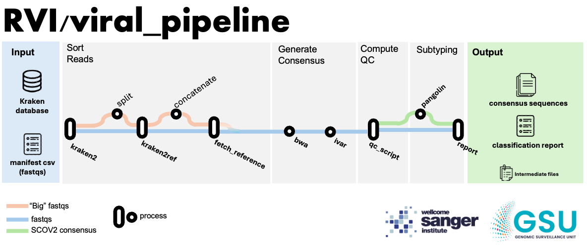

[](https://www.nextflow.io/) [](https://sylabs.io/docs/) 

---
# Viral Pipeline

The viral pipeline is a Nextflow pipeline developed under the context of the [RVI project]() by [GSU]() and its main goal is to identify the presence of Flu, SARS-CoV-2 and RSV and obtain, if possible, high quality consensus sequences for those virus. For more details, check the [[ADD REFERENCE PAPER]]()

---

## Pipeline Summary

The pipeline takes a manifest containing  **fastq pairs file** paths and a **kraken detabase** as inputs (check [[ADD INPUT DOCUMENTATION LINK]]() for more details) and outputs a **classification report**, **consensus sequences** and a **collection of intermediate files** (check [[ADD OUTPUT DOCUMENTATION LINK]]() for more details). Here is an broad overview of the pipeline logic

1. **Sort Reads**: The initial step is sort reads using `kraken2` for each fastq pairs according to the database provided. The classified reads is used as input to `kraken2ref` which will generate one pair of fastq files per taxid found. 
   - An option to split big files is provided (check [[ADD LINK TO PARAM]]()).
2. **Generate Consensus**: After all samples been classified, all references observed for that samples batch are fetch from the `kraken database` (or an arbitrary fasta file provided by the user). The classfied reads are aligned to their respective references (via `bwa`). The alignment is used as input for `ivar` to obtain a consensus sequence. 
3. **Compute QC**: QC metrics are computed via `samtools` and a custom script (`qc.py`)
4. **SARS-CoV-2 Subtyping**: SARS-CoV-2 subtyping can be done if present on the sample



---


## How to Cite

---
## Quick Start

---
## Installation

### dependencies

- [Nextflow](https://www.nextflow.io) (tested on v23.10.0)
- [Singularity](https://docs.sylabs.io/guides/latest/user-guide/) (required to use Singularity Containers)

> We strongly recommend to run the pipeline using the containers recipe provided at `containers/` subdir.

If not using containers, all the software needs to be available at run time. A list of those softwares can be found [[ADD LINK TO SOFTWARE VERSIONS DOCUMENTATION]](./doc/requirements.md)

### build containers

Recipes for the Singularity container used on this pipeline are available on this repository at `containers/` dir. To build the containers, run the command bellow.


```{bash}
cd containers/
sudo singularity build base_container.sif baseContainer.sing
sudo singularity build ivar.sif ivarContainer.sing
sudo singularity build pangolin.sif pangolinContainer.sing
sudo singularity build kraken.sif krakenContainer.sing
sudo singularity build kraken2ref.sif kraken2ref.sing
```

> NOTE: Currently we only support running on Singularity local containers, but we should add Docker container registries soon

## Usage

1. **Generate manifest**
For convenience, a script to generate the manifest is provided on this repo

```{bash}
python write_manifest.py ./path/to/my/fastqs_dir/ -fq1_ext my_r1_ext -fq2_ext my_r2_ext
```

2. **Run pipeline**

```{bash}
nextflow run /path/to/rvi_consensus_gen/main.nf --manifest /path/to/my/manifest.csv \
        --db_path /path/to/my/kraken_db \
        --results_dir outputs/ \
        --containers_dir /path/to/my/containers_dir/ \
        -profile sanger_stantard -resume -with-trace -with-report -with-timeline
```

Optionally is possible to start the pipeline from **GENERATE_CONSENSUS**

```{bash}
nextflow run ${CHECKOUT}/main.nf --entry_point consensus_gen \
        --consensus_mnf sorted_manifest.csv
        --results_dir $LAUNCHDIR/outputs/ \
        --containers_dir /path/to/containers_dir/ \
        -profile sanger_standard-resume -with-trace -with-report -with-timeline
```


## Inputs

- `manifest` : Manifest of input fastq file pairs.
  - Must have `sample_id`,`reads_1` and `reads_2` collumns
  - if using the `consensus_gen` entry point, the manifest must containing pair ended reads and genome reference files for each pair.
    - must have `sample_id`, `taxid`, `ref_files`, `reads_1`, `reads_2`

- `db_path` : Path of kraken2 database

For more details check [[ADD INPUTS DOC]]()

## Parameters

- **General**

  - `containers_dir` [DEFAULT =  `containers/` dir of this repository] : By default, the pipeline relies on Singularity containers and __assumes__ all containers are present on this directory and were named on a specific manner
  - `results_dir` [DEFAULT = `$launchDir/output/`] : set where output files should be published. By default, it will write files to an `output/` dir (if not existent, it will be created) at pipeline launch directory.

- **Pipeline flow controls**

  - `entry_point` [Default = "sort_reads"] : Defines the entry point of the pipeline. The `sort_reads`
  - `scv2_keyword` [Default = "Severe acute respiratory syndrome coronavirus 2"] : keyword to identified samples with SARS-CoV-2. This string is obtained from the kraken2 database, therefore, it should be in line with the database in use.
  - `do_scov2_subtyping` [Default = true] : Switch SARS-CoV-2 on and off.

- **Specific processes**

  - `get_taxid_references`:
    - `db_library_fa_path` [Default = null]: A fasta file containing reference sequences for the taxids present on the kraken database.

  - `raken2ref`:
    - `k2r_fq_load_mode` [Default = "full"] : kraken2ref load fastq into memory mode ["full"/"chunk"]
    - `k2r_max_total_reads_per_fq` [Default = 10000000] : set maximum number of reads to be accepted any classified fastq file pair. Files excedding that limit will be splitted before `run_k2r_dump_fastq`.
    - `k2r_dump_fq_mem` [Default = "6 GB"] : Memory to be requested by `run_k2r_dump_fq`, adjust according to `k2r_max_total_reads_per_fq`.
    - `min_reads_for_taxid` [Default = 100] : min reads number to be considered.

> NOTE: `Kraken2ref` have a escalation memory strategy based on linear regression, check [[ADD CONF DOC LINK]]() for more details.

  - **ivar**
    - `ivar_min_depth` [Default = 10] : Minimum depth to call consensus
    - `ivar_freq_threshold` [Default = 0.75] : Minimum frequency threshold(0 - 1) to call consensus.

> TODO: check if all pipeline parameters are covered and add missing ones

## Unit Tests
---
The workflow & process unit tests for this pipeline are written in the [nf-test](https://www.nf-test.com/) (v0.8.4) Nextflow testing framework.

**Running Tests**

The following command if entered from the repository top-level directory can be used to execute all of the per-process & per-workflow unit tests:

**Run all tests**

```{bash}
nf-test test ./
```

**Run individual module/workflow test**

```{bash}
nf-test test tests/<modules or workflows>/<module_to_test>.nf.test
```

---
## Licence

[ADD LICENSE]
